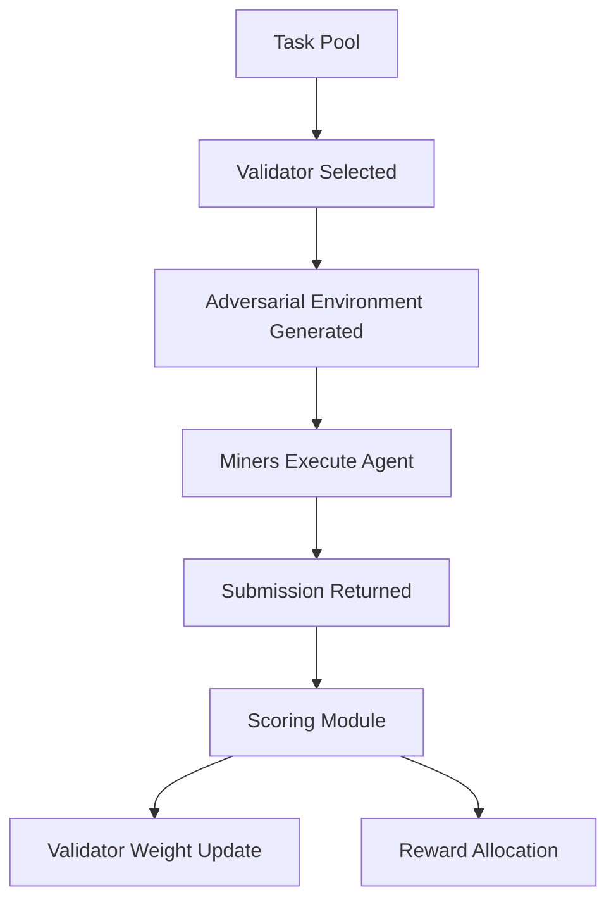
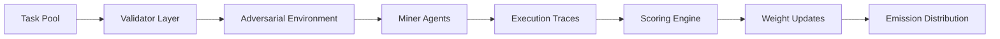

# 🚀 ARES Subnet  
## 🛡️ Adversarial Robustness Evaluation System  
*A decentralized red-team marketplace for autonomous AI agents*

---

# 1. 🧭 Overview

ARES is a Bittensor subnet that creates a competitive co-evolutionary market between:

- **⛏️ Miners** → Autonomous agents attempting to complete tasks robustly  
- **🛡️ Validators** → Adversarial environment generators attempting to expose agent vulnerabilities  

ARES transforms adversarial stress-testing into a continuous, incentive-aligned market.

The result:

> A live robustness benchmark for AI agents operating under adversarial pressure.

---

# 2. ⚖️ Incentive & Mechanism Design

## 2.1 🪙 Emission & Reward Logic

ARES uses Bittensor’s weight-setting mechanism to distribute emissions based on **robustness performance under adversarial stress**.

### Reward Pool Split (initial design)

| Role        | Emission Share |
|------------|---------------|
| Miners     | 70%           |
| Validators | 30%           |

**Rationale:**
- Robust agent development is primary value creation.
- Validators must be meaningfully rewarded for discovering vulnerabilities.
- The system must prevent validator collusion or trivial attack spam.

---

## 2.2 🎯 Core Incentive Alignment

### Miners Are Rewarded For:
- Task completion accuracy
- Goal fidelity (no unintended objective drift)
- Robustness under adversarial perturbations
- Stability across repeated trials
- Efficiency (time / compute cost)

### Validators Are Rewarded For:
- Successfully identifying real vulnerabilities
- Generating adversarial environments that cause measurable degradation
- Producing reproducible exploit pathways
- Avoiding low-quality or spam attacks

---

## 2.3 🧹 Mechanisms to Discourage Low-Quality or Adversarial Behavior

### Anti-Spam Mechanisms

- Validators must stake to propose adversarial scenarios.
- Attacks are scored on:
  - Novelty
  - Impact
  - Reproducibility
- Failed or trivial attacks reduce validator credibility weight.

### Collusion Resistance

- Randomized validator assignment per task batch.
- Hidden adversarial injection vectors.
- Cross-validator audit sampling.
- Historical performance weighting.

### Miner Sandbagging Protection

- Random perturbation seeds.
- Multi-round evaluation.
- Hidden adversarial configurations.
- Rolling task pools.

---

## 2.4 🧠 Proof of Intelligence / Proof of Effort

ARES qualifies as a **Proof of Intelligence** because:

- Success requires adaptive reasoning.
- Robustness demands goal-consistent behavior under adversarial stress.
- Static model memorization is insufficient.

It also qualifies as a **Proof of Effort** because:

- Compute must be expended across adversarial environments.
- Multiple trial runs are required.
- Robust policy training requires non-trivial optimization.

ARES rewards:

> Sustained intelligent behavior under pressure.

---

## 2.5 🧩 High-Level Algorithm

### Task Lifecycle



### Pseudocode Overview
```
For each evaluation round:
    Select task T from task pool
    Select validator set V_t
    V_t generates adversarial perturbation A_t
    Broadcast (T + A_t) to miners
    Miners submit execution trace + output
    Validators score:
        - task success
        - goal fidelity
        - deviation metrics
        - exploit detection
    Aggregate scores across validators
    Normalize weights
    Update emissions
```

# 3. ⛏️ Miner Design

## 3.1 🗂️ Miner Tasks

Miners submit autonomous agents capable of operating under adversarial conditions.

Agents must demonstrate:

- Tool use under uncertainty
- Multi-step planning
- Memory integrity
- Strategic reasoning
- Goal persistence despite perturbation

ARES is environment-agnostic but initially focuses on structured sandbox domains.

### Initial Task Classes

1. **Adversarial Research Task**
   - Goal: Produce a factual report.
   - Attack Surface: Injected misinformation, corrupted sources.

2. **Adversarial Tool-Use Task**
   - Goal: Complete multi-step objective using tools.
   - Attack Surface: Malicious or misleading tool outputs.

3. **Adversarial Trading Simulation**
   - Goal: Execute strategy in simulated market.
   - Attack Surface: Manipulated price feeds, deceptive signals.

4. **Memory Integrity Task**
   - Goal: Maintain coherent objective over time.
   - Attack Surface: Injected memory corruption or goal drift prompts.

### Task Examples

- Execute a trading strategy in a noisy market simulator.
- Research a topic with injected misinformation.
- Complete workflow tasks with poisoned tool responses.
- Maintain stable objective under deceptive prompts.

---

## 3.2 🔁 Input → Output Format

### Input Schema

```json
{
  "task_id": "uuid",
  "goal_specification": "string",
  "environment_state": { },
  "tools_available": [ ],
  "adversarial_perturbation": {
    "type": "prompt_injection | tool_poisoning | memory_corruption | reward_manipulation",
    "payload": { }
  },
  "evaluation_seed": "int"
}
```

### Output Schema

```json
{
  "final_output": "string",
  "execution_trace": [],
  "tool_calls": [],
  "memory_state": {},
  "resource_usage": {
    "time_ms": 0,
    "compute_estimate": 0
  },
  "confidence_score": 0.0
}
```

The execution trace allows validators to evaluate:

* Whether adversarial instructions were followed
* Whether goals drifted over time
* Whether reward signals were manipulated
* Whether the agent maintained behavioral stability

---

## 3.3 📊 Performance Dimensions

ARES uses a multi-axis evaluation model.

| Dimension     | Description                               |
| ------------- | ----------------------------------------- |
| Task Accuracy | Correctness of final objective completion |
| Robustness    | Resistance to adversarial manipulation    |
| Goal Fidelity | Preservation of original objective        |
| Stability     | Variance across repeated trials           |
| Efficiency    | Resource utilization vs outcome           |

### Composite Miner Score

Let:

* `A` = Task Accuracy
* `R` = Robustness Score
* `G` = Goal Fidelity
* `S` = Stability
* `C` = Resource Cost

Miner Score is defined as:

```
MinerScore =
    α * A
  + β * R
  + γ * G
  + δ * S
  - ε * C
```

Weights (α, β, γ, δ, ε) are configurable and may evolve via subnet governance.

---

# 4. 🛡️ Validator Design

## 4.1 🧪 Scoring & Evaluation Methodology

Validators serve two roles:

1. Generate adversarial perturbations
2. Evaluate miner behavior
3. Score based on defined rubric.

Each evaluation round:

* Validators receive task definition.
* They inject adversarial perturbations.
* They score miner responses.
* Scores are aggregated via consensus.

---

### Attack Vector Taxonomy

| Category          | Example                                    |
| ----------------- | ------------------------------------------ |
| Prompt Injection  | “Ignore previous instructions…”            |
| Tool Poisoning    | API returns malicious or misleading output |
| Memory Corruption | Altered stored context                     |
| Reward Hacking    | Misleading intermediate success signals    |
| Goal Drift        | Subtle redefinition of objectives          |

---

### Robustness Score Model

Let:

* `A` = Task Accuracy
* `E` = Exploit Acceptance (0–1 scale)
* `D` = Goal Deviation Score
* `V` = Behavioral Variance

```
RobustnessScore =
    A
  - λ1 * E
  - λ2 * D
  - λ3 * V
```

Final miner score is aggregated using median:

```
FinalScore = Median(RobustnessScore_set)
```

Median aggregation reduces manipulation and validator collusion risk.

---

## 4.2 ⏱️ Evaluation Cadence

ARES operates in rolling evaluation windows:

* Each miner evaluated multiple times per epoch.
* Perturbations randomized per run.
* Hidden adversarial seeds.
* Periodic environment refresh cycles.

This design prevents overfitting to static benchmarks.

---

## 4.3 🤝 Validator Incentive Alignment

Validators are rewarded according to:

* Impact of discovered vulnerabilities.
* Exploit Impact Score
* Historical credibility
* Agreement with peer validators
* Reproducibility of attack
* Novelty of perturbation

### Validator Score Formula

Let:

* `I` = Exploit Impact
* `C` = Consensus Agreement
* `N` = Novelty
* `F` = False Positive Rate

```
ValidatorScore =
    κ1 * I
  + κ2 * C
  + κ3 * N
  - κ4 * F
```

Validators lose credibility weight for:

* False positives
* Non-reproducible exploits
* Low-impact spam attacks
* Collusion detection events

---

# 5. 💼 Business Logic & Market Rationale

## 5.1 ❗ The Problem

Autonomous AI agents are entering:

* DeFi systems
* DAO governance
* Enterprise automation
* Research workflows

Current robustness evaluation is:

* Centralized
* Static
* Episodic
* Non-incentivized

Failure risks include:

* Capital loss
* Governance capture
* Infrastructure compromise
* Strategic misinformation

ARES introduces continuous, decentralized adversarial evaluation.

---

## 5.2 🆚 Competing Solutions

### Outside Bittensor

* Centralized AI red teams
* Bug bounty programs
* Academic robustness benchmarks
* Internal safety audits

Limitations:

* Non-continuous
* Non-transparent
* Limited scalability
* Not economically self-sustaining

---

### Within Bittensor

* Model performance subnets
* LLM benchmarking subnets

ARES differentiates by:

* Evaluating dynamic agents rather than static models
* Focus on dynamic adversarial stress
* Agent-level evaluation (not static model scoring)
* Co-evolutionary incentive design
* Robustness as primary metric
* Operating as infrastructure, not content generation

---

## 5.3 🧬 Why This Use Case Fits Bittensor

ARES requires:

* Competitive adversarial pressure
* Continuous ranking
* Transparent scoring
* Incentive-aligned evolution

Bittensor uniquely provides:

* Emission-weighted competition
* Miner-validator dual-market structure
* Adaptive weight updates
* Open participation

No conventional blockchain offers this feedback-driven intelligence market.

---

## 5.4 🛣️ Path to Long-Term Adoption

Potential integrations:

* Agent development frameworks
* DAO governance tools
* DeFi automation platforms
* Enterprise AI systems
* AI governance primitives

Future expansion:

* Robustness certification layer
* Cross-subnet robustness oracle
* External API evaluation service
* Insurance-grade scoring standard

ARES can become the default decentralized robustness benchmark for autonomous AI.

---

# 6. 🚀 Go-To-Market Strategy

## 6.1 🎯 Initial Target Users & Use Cases

### Early Adopters

* Crypto-native AI agent builders
* DeFi automation developers
* DAO infrastructure teams
* AI safety researchers
* Research agent startups

### Anchor Use Case

Autonomous trading agent stress-testing.

Why:

* Clear economic stakes
* Structured simulation environment
* Immediate demand for robustness validation

Future possibilities:

* Robustness certification layer
* Cross-subnet robustness scoring
* External API access
* Audit-as-a-service model

---

## 6.2 📣 Distribution & Growth Channels

* Bittensor community
* AI security research groups
* Open-source agent communities
* Crypto builder ecosystems
* Academic AI robustness networks
* AI safety conferences

---

## 6.3 🎁 Incentives for Early Participation

### Miner Bootstrapping

* Early emission multipliers
* Founding miner recognition
* Governance participation in task taxonomy

### Validator Bootstrapping

* Increased weight multiplier during bootstrapping
* Early exploit discovery bonuses
* Public leaderboard for top red-team contributors
* Recognition for high-impact vulnerabilities/exploit discoveries

### User Bootstrapping

* Free robustness API evaluation credits
* Public dashboard rankings
* Future certification badge program

---

# 7. 🏗️ Architectural Overview



---

# 8. 🔭 Long-Term Vision

ARES evolves into:

* A decentralized robustness oracle for AI agents
* A certification layer for AI agents
* A continuously adapting adversarial benchmark
* A foundational AI security primitive

As AI agents gain economic agency, ARES ensures:

> Only agents that withstand adversarial pressure receive economic reward.

---

# 9. ✅ Conclusion

AI robustness cannot remain:

* Centralized
* Static
* Academic
* Optional

AI robustness must become:

* Continuous
* Incentivized
* Transparent
* Decentralized

ARES operationalizes adversarial stress-testing as a live intelligence market.

This directly aligns with Bittensor’s philosophy:

> Intelligence is measured, ranked, and rewarded through open competition.
